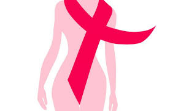

# Classification de patients souffrant d’un cancer  

Anne-Laure MEALIER 14.01.2021  

Avec environ 54 062 nouvelles personnes touchées chaque année, le cancer du sein est le plus répandu des cancers féminins mais également masculin.  
Près d'une femme sur neuf sera concernée au cours de sa vie, le risque augmentant avec l'âge. Moins de 10% des cancers du sein surviennent avant 40 ans.  
L’incidence augmente ensuite régulièrement jusqu’à 65 ans.  

## Ressource(s)  

* https://mrmint.fr/introduction-k-nearest-neighbors  
* https://en.wikipedia.org/wiki/K-nearest_neighbors_algorithm  
* https://www.datacamp.com/community/tutorials/k-nearest-neighbor-classification-scikit-learn  
* http://dataaspirant.com/2016/12/23/k-nearest-neighbor-classifier-intro/  
* https://stackabuse.com/k-nearest-neighbors-algorithm-in-python-and-scikit-learn/  
* https://fr.wikipedia.org/wiki/M%C3%A9thode_des_k_plus_proches_voisins#:~:text=En%20reconnaissance%20de%20forme%2C%20l,la%20classification%20et%20la%20r%C3%A9gression.&text=en%20r%C3%A9gression%20k%2DNN%2C%20le,des%20k%20plus%20proches%20voisins.  
* https://simplonline-v3-prod.s3.eu-west-3.amazonaws.com/media/file/csv/4c343ce6-966b-4ba5-a4e9-16bdbd57c6b1.csv  

## Contexte du projet  

Après avoir doublé entre 1980 et 2005, l'incidence semble désormais en phase de stabilisation.  
Plus encourageant encore, la mortalité n'a, elle, pas augmenté depuis les années 80.  
Le résultat d'énormes progrès, tant au niveau du dépistage que de la prise en charge médicale de la maladie.  
Pour preuve, aujourd'hui, plus de 3 cancers du sein sur 4 sont guéris en sachant que tous les types de cancers n’ont pas le même pronostic !  
Ces scores encourageants sont le fruit de l’effort de la médecine préventive mais également de la capacité du corps médical à prendre en charge rapidement les patients.

Ce sujet vous touche particulièrement et vous souhaitez aider le corps médical dans son processus de dépistage.  
Ce matin vous avez décidé de développer un classifieur vous permettant d’identifier rapidement la gravité du cancer.  
Et ainsi de distinguer si les cellules cancéreuses sont bénignes ou malignes.  

Le dataset initial a été créé dans le but de prédire si les cellules cancéreuses sont bénignes ou malignes.

## Data set  

Informations sur les attributs :  
* Sample code number: id number  
* Clump Thickness: 1 - 10  
* Uniformity of Cell Size: 1 - 10  
* Uniformity of Cell Shape: 1 - 10  
* Marginal Adhesion: 1 - 10  
* Single Epithelial Cell Size: 1 - 10  
* Bare Nuclei: 1 - 10  
* Bland Chromatin: 1 - 10  
* Normal Nucleoli: 1 - 10  
* Mitoses: 1 - 10  

Predicted class :  
* 2 for benign  
* 4 for malignant  

Cet ensemble de données provient de Original Wisconsin Breast Cancer Database.
Pour réaliser cette classification de patients porteurs de cellules cancéreuses bénignes ou malignes, nous allons utiliser un algorithme kNN.  
Le classificateur kNN ou k-Nearest Neighbours est un algorithme d'apprentissage automatique très simple et facile à comprendre.  
Le but de ce brief est de mettre en place un classificateur k Nearest Neighbours pour classer les patients souffrant de cancer du sein.  

Ce document décrit les étapes à réaliser pour mettre en oeuvre un KNN et évaluer les performances de ce dernier :
* https://docs.google.com/document/d/1CwwMb0IfgWhOcWYvIjsKBvd0P0I80XsSOoKEL6zTm_I/edit?usp=sharing  

## Modalités pédagogiques  

Le projet doit être soumis au plus tard le lundi 18 à 17h30.  

## Critères de performance  

* Métriques d'évaluation  
* Validation croisée K-Fold  
* Comparer les performances d'un autre classifieur  

## Livrables  

Un rendu individuel doit se faire sous la forme d'un notebook jupyter que vous déposerez sur Github.  
Le lien github sera partagé sur Simplonline.  

