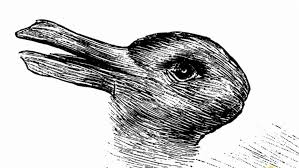

# Who are you ?  

Anne-Laure MEALIER 04.02.2021  

Nous allons construire un modèle de base pour classer les images en fonction de leurs caractéristiques HOG.  
Ce projet va vous permettre de mettre en place des mécanismes d’automatisation de pipeline de données,  
Et de recherche de paramètres optimaux pour des modèles de classification.  
Cette méthodologie est générique et peut être appliquée à toutes sortes de problèmes d'apprentissage automatique.

## Ressource(s)  

* https://docs.google.com/document/d/1DFLRRamNrtYReVIj8FAtJvGrFsZZ8BP0f-e2YZn8hus/edit?usp=sharing  
* https://vcla.stat.ucla.edu/people/zhangzhang-si/HiT/AnimalFace.zip  

## Contexte du projet  

Un ami enseignant vous explique qu'il souhaiterait utiliser une application de labellisation automatique d'images pour l'assister dans ses ateliers avec des enfants de maternelle.  
Au fil des années, il a accumulé de très nombreuses images d'animaux permettant d'évoquer différents thèmes tels que la jungle, la forêt, la ferme etc ...  
Malheureusement ces images ne sont pas triées et représentent 500 Go de données sur un disque dur !  
En tant que scientifique et rempli d'empathie, vous vous dites que vous ne pouvez pas laisser votre ami chercher pendant plusieurs heures les photos qui lui permettront d'appréhender sereinement le thème de la ferme le lendemain.  
L’idée soudaine vous vient de créer un algorithme de classification d’images qui lui permettrait par la suite de labelliser automatiquement ses magnifiques images.  
Enthousiaste par votre brillante idée, vous commencez par vous congratuler !  
Puis vous lui promettez de revenir vers lui dans quelques jours avec le logiciel qui va révolutionner son emploi du temps !  
En lui évitant de nombreuses heures de recherches dans ses données !

## Modalités pédagogiques  

* https://docs.google.com/document/d/1DFLRRamNrtYReVIj8FAtJvGrFsZZ8BP0f-e2YZn8hus/edit?usp=sharing  

## Critères de performance  

* Grid Search  
* Cross-validation  
* Test unitaires / tests fonctionnels  
* Validation du modèles sélectionné sur un autre jeu de données provenant de Google Images  
* Base de données permettant l'accès au données  
* Application permettra de retourner les résultats provenants de différents Framework (Scikit-Learn, Keras et Pytorch)  

## Modalités d'évaluation  

Un livrable individuel partagé via github dont le lien https sera accessible sous Simplonline

## Livrables  

Une application permettant de classer des images d'animaux  

